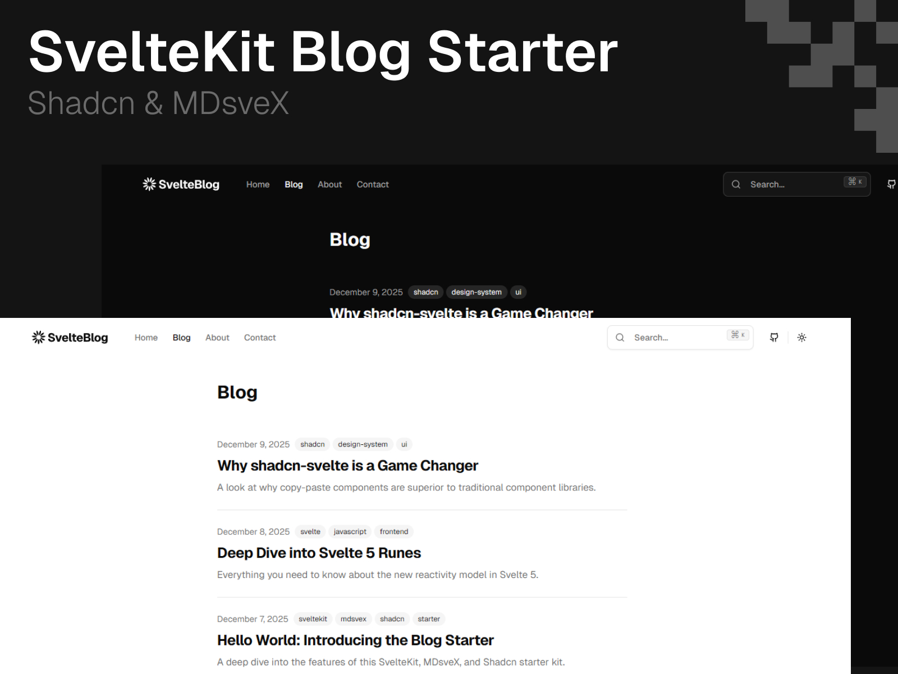

# SvelteKit Shadcn Blog Starter

<div align="center">

[](https://github.com/YusufCeng1z/sveltekit-shadcn-blog-starter/stargazers)
[](https://opensource.org/licenses/MIT)

</div>



A modern, feature-rich blog starter template built with SvelteKit, shadcn-svelte, Tailwind CSS, and MDsveX. This starter provides everything you need to launch a professional blog in minutes, not hours.

**[Live Demo](https://sveltekit-blog-starter.netlify.app)** | **[Example Blog Post](https://sveltekit-blog-starter.netlify.app/blog/hello-world)** | **[Author Page](https://sveltekit-blog-starter.netlify.app/authors/yusuf-cengiz)** | **[RSS Feed](https://sveltekit-blog-starter.netlify.app/rss.xml)** | **[Sitemap](https://sveltekit-blog-starter.netlify.app/sitemap.xml)**

## What You Get

```
⚡ 5 minutes to deploy    📝 Write in Markdown    🎨 Beautiful UI out of the box
🔍 SEO optimized          🌙 Dark mode ready      📱 Fully responsive
```

## Why This Starter?

Creating a blog from scratch involves countless decisions and configurations. This starter eliminates that complexity by providing a production-ready foundation that you can customize to your needs. Simply clone, write your content, and deploy.

## Features

**Content Management**
- Write blog posts in Markdown with full Svelte component support (MDsveX)
- Multi-author support with dedicated author profile pages
- Tag-based organization with automatic tag pages
- Built-in search functionality

**Design & UX**
- Beautiful, accessible UI components from shadcn-svelte
- Dark/light theme with automatic system preference detection
- Fully responsive, mobile-first design
- Tailwind CSS for easy customization

**SEO & Performance**
- Auto-generated sitemap.xml and RSS feed
- Optimized meta tags and Open Graph support
- Fast page loads with SvelteKit's built-in optimizations
- TypeScript for type safety and better developer experience

## Quick Start

```bash
# Clone the repository
git clone https://github.com/YusufCeng1z/sveltekit-shadcn-blog-starter.git
cd sveltekit-shadcn-blog-starter

# Install dependencies
npm install

# Start development server
npm run dev
```

Open [http://localhost:5173](http://localhost:5173) and start customizing your blog.

## Project Structure

```
sveltekit-blog-starter/
├── src/
│   ├── lib/
│   │   ├── components/     # Reusable UI components
│   │   └── config/         # Site configuration
│   ├── posts/              # Your blog posts (Markdown)
│   └── routes/
│       ├── blog/           # Blog listing and post pages
│       ├── authors/        # Author profile pages
│       ├── tags/           # Tag archive pages
│       ├── sitemap.xml/    # Auto-generated sitemap
│       └── rss.xml/        # Auto-generated RSS feed
└── static/                 # Static assets (images, etc.)
```

## Creating Your First Blog Post

1. Create a new `.md` file in `src/posts/`:

```markdown
---
title: "My First Blog Post"
description: "A brief description of your post"
date: "2025-12-08"
tags: ["tutorial", "getting-started"]
author: "your-author-id"
---

# Welcome to My Blog

Start writing your content here using Markdown...
```

2. The post automatically appears on your blog page
3. Tags and author pages are generated automatically

## Configuration

Edit `src/lib/config/site.ts` to customize your blog:

```typescript
export const siteConfig = {
    name: "Your Blog Name",
    url: "https://yourdomain.com",
    description: "Your blog description",
    links: {
        twitter: "https://twitter.com/yourusername",
        github: "https://github.com/yourusername",
    },
};
```

## Deployment

### Deploy to Netlify (Recommended)

1. Push your code to GitHub
2. Go to [Netlify](https://app.netlify.com) and click "New site from Git"
3. Select your repository
4. Click "Deploy site" (build settings are auto-detected)

Your blog will be live in minutes with automatic deployments on every push.

### Other Platforms

This starter works with any SvelteKit-compatible platform:
- **Vercel**: Install `@sveltejs/adapter-vercel`
- **Cloudflare Pages**: Install `@sveltejs/adapter-cloudflare`
- **Node.js**: Install `@sveltejs/adapter-node`

See [SvelteKit adapters documentation](https://kit.svelte.dev/docs/adapters) for details.

## Built With

- [SvelteKit](https://kit.svelte.dev/) - Full-stack web framework
- [Svelte 5](https://svelte.dev/) - Reactive UI framework with Runes
- [MDsveX](https://mdsvex.pngwn.io/) - Markdown with Svelte components
- [shadcn-svelte](https://www.shadcn-svelte.com/) - High-quality UI components
- [Tailwind CSS](https://tailwindcss.com/) - Utility-first CSS framework
- [TypeScript](https://www.typescriptlang.org/) - Type-safe JavaScript

## Customization

**Styling**: Edit `src/routes/layout.css` for global styles or use Tailwind utility classes throughout your components.

**Components**: All UI components are in `src/lib/components/` and can be customized to match your brand.

**Authors**: Add author information in your author configuration to enable multi-author support.

## Building for Production

```bash
# Create production build
npm run build

# Preview production build locally
npm run preview
```

## Contributing

Contributions are welcome! Please read [CONTRIBUTING.md](CONTRIBUTING.md) for details on our code of conduct and the process for submitting pull requests.

## License

This project is licensed under the MIT License - see the [LICENSE](LICENSE) file for details.

---

## Show Your Support

If this starter helped you launch your blog faster, please consider giving it a star on GitHub! Your support helps others discover this project and motivates continued development.

**Why star this project?**
- Help other developers find a quality blog starter
- Show appreciation for the work that went into this
- Get notified about new features and updates
- Support open-source development

[⭐ Star this project on GitHub](https://github.com/YusufCeng1z/sveltekit-shadcn-blog-starter)

---

**Built with ❤️ by [Yusuf Cengiz](https://github.com/YusufCeng1z)**

Have questions or suggestions? [Open an issue](https://github.com/YusufCeng1z/sveltekit-shadcn-blog-starter/issues) or reach out!
